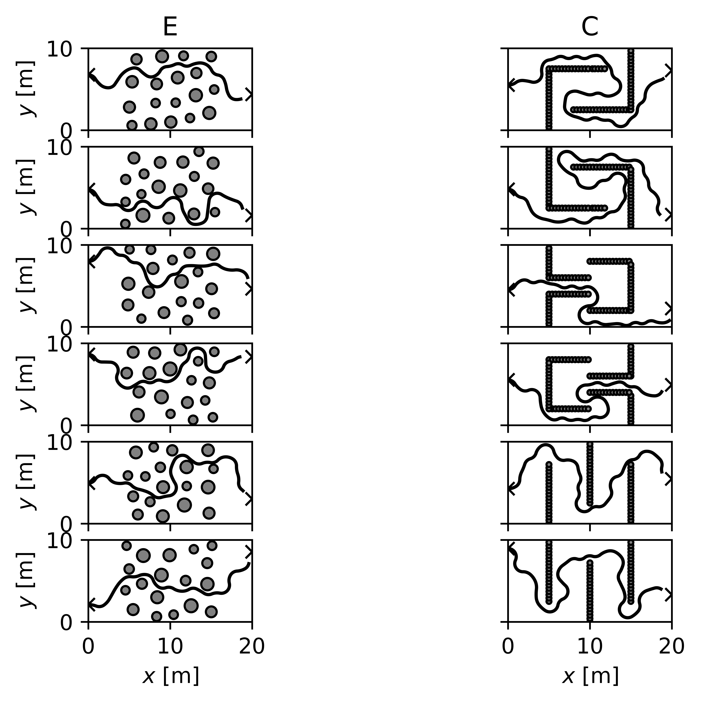

# Dubin's Car

## Useful resources
 - [PythonRobotics](https://github.com/AtsushiSakai/PythonRobotics#path-planning) for planning algorithms,
 - [demo.ipynb](demo.ipynb) for this assignment's introduction.


## Description
In this assignment you're tasked to implement a robotic planning method in order to drive a Dubins car, with the dynamics
```python
x[t+1]     = x[t]     + cos(theta[t])
y[t+1]     = y[t]     + sin(theta[t])
theta[t+1] = theta[t] + tan(phi[t])
```
from an initial position `(x0,y0)` to a target position `(xt, yt)`, while avoiding both collisions with obstacles and venturing out of bounds.

The state variables are:
 - `x`: horizontal position
 - `y`: vertical position
 - `theta`: heading angle (direction of travel)

And, the sole control variable is the steering angle `phi ∈ [-pi/4, pi/4]` (with respect to the direction of travel).

**Tip**: you can simplify the planning problem by lowering the number of control choices though discretisation, e.g. `phi ∈ {-pi/4, 0, pi/4}`.

## Tasks

We'll consider two graded tasks in order of difficulty:
 - **E** — reach the target with circular obstacles;
 - **C** — reach the target with line obstacles.

**Note**:
- the line obstacles are represented by a series of circular obstacles,
- the initial and target positions are randomised,
- and the obstacle in Kattis are different.

Using the API, explained below, generate a sequence of steering angle commands `controls` and a sequence of times `times`, between which the commands are executed, that would yield a collision-free and task-fulfilling trajectory.

You should end up with a solution that looks something like this:



## Solution
Submit a file named `solution.py`,
```python
#!/usr/bin/env python3
# -*- coding: utf-8 -*-
# {student full name}
# {student id}
# {student email}

from dubins import *

def solution(car):

  '''
  Your code below
  '''

  # initial state
  x, y = car.x0, car.y0
  theta = 0

  # arbitrary control
  phi = 0.2

  # compute next state after 0.01 seconds
  xn, yn, thetan = step(car, x, y, theta, phi)

  # assemble path
  controls, times = [phi], [0, 0.01]

  '''
  Your code above
  '''

  return controls, times
```
, containing a function `solution` that receives a `Car` object `car` and returns a tuple containing,
 - `controls : list`: sequence of steering angles `controls[i] : float`
 - `times : list`: sequence of times at which the controls are executed `times[i] : float`

, where it should be noted that `controls[i]` is considered to be constant between `times[i]` and `times[i+1]`, hence `len(controls) == len(times) - 1`. If needed, you may add ancillary code outside `solution(car)` within the `solution.py` file.

Your `solution` function should implement a robotic planning method, with the use of the attributes of `Car`, to produce a sequence of steering angles and times at which they're executed, that would drive the car successfully to the target. Good choices are A* and RRT.

The lists of `controls` and `times`, will be integrated to get a state path.
The integration will stop if the path goes into an obstacle, out of bounds, or within 1.5 meters of the target. 
This state path is judged on whether it avoided obstacles and made it to the target.

**Note**:
 - each steering angle `controls[i]` is considered to be constant between `times[i]` and `times[i+1]`, so `controls` must be one element shorter than `times`, i.e. `len(controls) == len(times) - 1`;
 - the initial time must be zero, i.e. `times[0] == 0`;
 - the time list must be spaced by `≥0.01` seconds;
 - each steering angle must be admissible, i.e. `-pi/4 <= controls[i] <= pi/4`;
 - the time sequence must increase, i.e. `times[i+1] > times[i]`;
 - the intial heading angle in evaluation is zero, i.e. `theta=0`;
 - the obstacles, intial positions, and target positions are randomised, so hard-coded solutions will not work;
 - the `Car` object `car` can not be altered in `solution(car)`.


You can evaluate your solution by executing the following terminal command from within the dubins directory:

```bash
>>> python3 main.py
Grade E: 6/6 cases passed.
Grade C: 6/6 cases passed.
```

You may also supply additional flags as so:
```bash
# show a plot
python3 main.py -p
# print trajectory information
python3 main.py -v
```

**Note**: you must install `matplotlib` for plotting to work.


## API

In this assignment, we'll work with the `Car` object, which you can import and instantiate as follows:

```python
from dubins import Car
car = Car()
```

The `Car` object has several attributes which you may find useful, namely:
 - `x0 : float`: initial x-position [m]
 - `y0 : float`: initial y-position [m]
 - `xt : float`: target x-position [m]
 - `yt : float`: target y-position [m]
 - `xlb : float`: minimum x-position [m]
 - `xub : float`: maximum x-position [m]
 - `ylb : float`: minimum y-position [m]
 - `yub : float`: maximum y-position [m]
 - `obs : list`: list of tuples for each obstacle `obs[i]`, where:
   - `obs[i][0] : float`: x-position [m]
   - `obs[i][1] : float`: y-position [m]
   - `obs[i][2] : float`: radius [m]

**Note**: again, you should not alter these attributes in `solution(car)`.

The method that you'll need to utilise in your implementation of robotic planning methods is `step(car, x, y, theta, phi)` (imported from `dubins`), which takes as its arguments:
 - `car : Car`: instance of `Car`
 - `x : float`: x-position
 - `y : float`: y-position
 - `theta : float`: heading angle
 - `phi : float`: steering angle

and returns a tuple of the form `(xn, yn, thetan)`, containing:
 - `xn : float`: new x-position
 - `yn : float`: new y-position
 - `thetan : float`: new heading angle

After computing the new state `xn, yn, thetan = step(car, x, y, theta, phi)`, check `car.obs` to see if the new state is within any obstacles, `(car.xlb, car.xub, car.ylb, car.yub)` to see if it is out of bounds, and `(car.xt, car.yt)` to see if it is close the the target state.