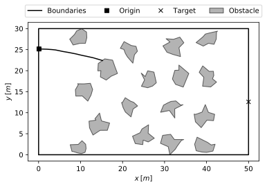

# Assignment

Using some robotic planning method, utilise the above attributes and methods of the `mission` object to write a Python script that effectively drives the car between the origin and target.

Create a script like function that returns the `mission` object with its records `mission.states`, `mission.times`, and `mission.controls` fully populated. Your function should look something like this:

```python
from dd2410planning import mission
def main():
  # instantiate mission
  mis = Mission()

  # do stuff
  ...
  ...
  ## maybe some RRTs
  ...
  ...

  return mis
```

## Validation
A **succesful** function will return a `mission` object in which `mission.states`, `mission.times`, `mission.controls` describe a trajectory which is both collision free and dynamical feasible.

One can check their success by calling `mission.simulate` the recorded control and time records, as such
```python
>>> mis.step(uf, Dt=500, record=True)
>>> mis.simulate(mis.controls, mis.times)
0.29766102200637323
>>> fig, ax = mis.plot_traj()
>>> fig.show()
```



We can see here that we *safely* travelled about 30% of the way to the target.
